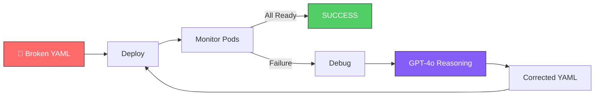

<p align="center">
  
</p>

<h1 align="center">
  Kube-AutoFix 
</h1>

<p align="center">
  <strong>An autonomous Kubernetes debugging agent that detects, diagnoses, and auto-repairs failing deployments using GPT-4o Structured Outputs — proving the concept of Agentic AI in Cloud Native infrastructure.</strong>
</p>

<p align="center">
  <a href="https://github.com/azaynul10/kube-autofix/stargazers"></a>
  <a href="https://github.com/azaynul10/kube-autofix/network/members"></a>
  <a href="https://github.com/azaynul10/kube-autofix/issues"></a>
  <a href="https://github.com/azaynul10/kube-autofix/blob/main/LICENSE"></a>
  
  
  
  
</p>

---

##  What is Kube-AutoFix?

**Kube-AutoFix** is a production-grade, autonomous agent that closes the loop between *"my deployment is broken"* and *"my deployment is fixed"* — without human intervention. It combines the **official Kubernetes Python Client** with **GPT-4o's structured reasoning** to execute a self-healing cycle that mimics what a Staff-Level SRE would do manually, but in seconds.

> **2026 Focus:** Exploring how Agentic AI Workflows can transform Cloud Native operations — from reactive alerting to autonomous self-healing infrastructure.

<p align="center">
  
</p>

---

## The Agentic Loop in Action

When a broken manifest is applied, Kube-AutoFix executes the following **fully autonomous loop**:



| Step | Action | Module |
| :---: | :--- | :--- |
| **1️⃣** | **Deploy** — Applies the YAML manifest using the official K8s Python Client | `k8s/deployer.py` |
| **2️⃣** | **Monitor** — Polls pod status every 5s. If `Running/Ready`, exits cleanly | `k8s/monitor.py` |
| **3️⃣** | **Debug** — Aggregates pod descriptions, namespace events, and previous container logs | `k8s/debugger.py` |
| **4️⃣** | **Reason** — Sends debug bundle + YAML to GPT-4o acting as a **Staff-Level SRE** | `llm/engine.py` |
| **5️⃣** | **Fix** — GPT-4o returns a validated JSON with root cause analysis + corrected YAML | `core/models.py` |
| **6️⃣** | **Apply** — Replaces the broken deployment and monitors the rollout | `core/agent_loop.py` |

> 🛑 **Safety:** The loop is hardcoded to a maximum of **5 iterations** to prevent runaway loops.

---

## ⚡ Features at a Glance

| Feature | Description |
| :--- | :--- |
|  **Fully Autonomous** | Zero human intervention from broken manifest to healthy deployment |
|  **GPT-4o Structured Outputs** | Uses `response_format=LLMDiagnosis` — guaranteed valid JSON, every time |
|  **Namespace Isolation** | Agent is **locked** to `autofix-agent-env`. Cannot touch other namespaces |
|  **7 Failure Types** | Detects `ImagePullBackOff`, `CrashLoopBackOff`, `OOMKilled`, `ErrImagePull`, and more |
|  **Deterministic Fixes** | `temperature=0.2` for consistent, conservative repairs |
|  **Tenacity Retries** | Exponential backoff on transient K8s and OpenAI API failures |
|  **Rich Terminal UI** | Beautiful spinners, color-coded panels, syntax-highlighted YAML, summary tables |
|  **Dry-Run Mode** | `--dry-run` flag to inspect the LLM's fix without applying it |
|  **Iteration Tracking** | Full summary table with confidence scores, durations, and outcomes |

---

##  Architecture

```mermaid
sequenceDiagram
    participant CLI as main.py
    participant Agent as agent_loop.py
    participant K8s as k8s modules
    participant LLM as llm engine
    participant EKS as AWS EKS
    participant GPT as GPT-4o

    CLI->>Agent: run(manifest)
    
    rect rgb(40, 40, 60)
        Note right of CLI: Iteration 1..5
        Agent->>K8s: apply_manifest(yaml)
        K8s->>EKS: Create/Update Resources
        
        Agent->>K8s: poll_until_ready()
        K8s->>EKS: Watch Pod Status
        
        alt All Pods Ready
            K8s-->>Agent: SUCCESS
            Agent-->>CLI: Exit 0
        else Failure Detected
            K8s-->>Agent: FAILED
            Agent->>K8s: collect_debug_bundle()
            K8s->>EKS: Describe + Logs + Events
            
            Agent->>LLM: diagnose(yaml, debug_bundle)
            LLM->>GPT: Structured Output Request
            GPT-->>LLM: LLMDiagnosis JSON
            
            Note over Agent: Update YAML, next iteration
        end
    end
```



---

##  Tech Stack

| Layer | Technology | Purpose |
| :--- | :--- | :--- |
| **Language** | Python 3.10+ | Core runtime |
| **K8s Client** | `kubernetes` (official) | Direct API interaction — no `kubectl` subprocess |
| **AI Engine** | `openai` SDK | GPT-4o with Structured Outputs (`beta.chat.completions.parse`) |
| **Validation** | `pydantic` + `pydantic-settings` | Strict schema enforcement for LLM I/O and config |
| **Terminal UI** | `rich` | Spinners, panels, syntax highlighting, tables |
| **Resilience** | `tenacity` | Exponential backoff on transient failures |
| **CLI** | `click` | Clean argument parsing with `--dry-run`, `--max-iterations` |
| **Config** | `python-dotenv` | `.env` file loading |

---

##  Safety Guardrails

Because this agent modifies **live infrastructure**, strict operational boundaries are enforced at **three layers**:

| Guardrail | Enforcement Layer | Detail |
| :--- | :--- | :--- |
|  **Namespace Lock** | Python + Prompt | Hardcoded to `autofix-agent-env`. The deployer forces `namespace=autofix-agent-env` on every resource |
|  **Max Iterations** | Python | Hard cap of 5 retries (configurable up to 10). Prevents infinite loops |
|  **Deterministic AI** | Prompt | `temperature=0.2` for conservative, reproducible fixes |
|  **Minimal Changes** | Prompt | LLM instructed: "Make the SMALLEST possible change to fix the root cause" |
|  **Resource Preservation** | Prompt | Never alter CPU/memory limits unless diagnosing `OOMKilled` |
|  **No New Resources** | Prompt | LLM cannot add Services/ConfigMaps unless explicitly required |
|  **YAML Validation** | Python | Post-LLM validation: syntax check, required fields, namespace override protection |

---

##  Quick Start

### 1. Install

```bash
git clone https://github.com/azaynul10/kube-autofix.git
cd kube-autofix
pip install -r requirements.txt
```

### 2. Configure

```bash
# Create .env with your API key
echo "OPENAI_API_KEY=your_key_here" > .env
```

### 3. Run

```bash
python main.py --manifest manifests/sample_broken.yaml
```

Watch the agent detect `ImagePullBackOff`, consult GPT-4o, and fix `nginx:latestttt` → `nginx:latest` autonomously! 🎉

<p align="center">
  
</p>

---

##  CLI Options

```bash
Usage: main.py [OPTIONS]

Options:
  -m, --manifest FILE           Path to the Kubernetes YAML manifest [required]
  -d, --dry-run                 Print corrected YAML without applying
  -n, --max-iterations [1-10]   Max autonomous retry loops (default: 5)
  -l, --log-level [DEBUG|INFO]  Logging verbosity (default: INFO)
  -h, --help                    Show this message and exit
```

**Examples:**

```bash
# Full autonomous mode
python main.py -m manifests/sample_broken.yaml

# Dry-run: inspect GPT-4o's fix without applying
python main.py -m manifests/sample_broken.yaml --dry-run

# Limit to 3 retries with debug logging
python main.py -m manifests/sample_broken.yaml -n 3 -l DEBUG
```

---

## 📁 Project Structure

```
kube-autofix/
├── main.py                      # CLI entrypoint (Click + Rich)
├── config.py                    # Pydantic Settings + namespace lock
├── requirements.txt             # 9 pinned dependencies
│
├── core/
│   ├── agent_loop.py            # The autonomous fix cycle + Rich UI
│   └── models.py                # 7 Pydantic models (LLMDiagnosis, PodStatus, etc.)
│
├── k8s/
│   ├── deployer.py              # Create-or-update via _RESOURCE_REGISTRY pattern
│   ├── monitor.py               # Poll loop + 7 failure type detection
│   └── debugger.py              # kubectl-describe replica + log collector
│
├── llm/
│   └── engine.py                # GPT-4o Structured Outputs + 7-rule SRE prompt
│
├── manifests/
│   └── sample_broken.yaml       # Deliberately broken nginx (ImagePullBackOff)
│
└── tests/
    └── test_phase3.py           # 16 validation tests
```

---

##  How It Was Built

This project was built in **4 rigorous phases**, each reviewed and approved before proceeding:

| Phase | Scope | Result |
| :---: | :--- | :--- |
| **1** | Architecture & Setup | Project structure, dependency manifest, module interaction design |
| **2** | K8s Wrapper | `deployer.py`, `monitor.py`, `debugger.py` — full cluster interaction |
| **3** | LLM Engine | GPT-4o integration with Structured Outputs, 16/16 tests passing |
| **4** | Agent Loop & CLI | Autonomous orchestrator with Rich terminal UI, verified on live EKS |

---

##  The LLM Prompt Strategy

The system prompt casts GPT-4o as a **Staff-Level Kubernetes SRE** with **7 strict operational boundaries**:

```
1. Namespace Lock     — Cannot change the namespace from autofix-agent-env
2. Minimal Changes    — Smallest possible fix, no refactoring
3. Resource Limits    — Don't touch CPU/memory unless OOMKilled
4. Image Tags         — Use well-known stable tags (nginx:latest, not guesses)
5. Valid YAML Only    — No markdown fences in output
6. Preserve Structure — Keep labels, selectors, annotations
7. No New Resources   — Don't add Services if only Deployment was provided
```

The response is forced into a **Pydantic schema** via OpenAI's Structured Outputs:

```python
class LLMDiagnosis(BaseModel):
    reasoning: str          # Step-by-step root cause analysis
    root_cause: str         # One-line summary
    confidence_score: float # 0.0 – 1.0
    corrected_yaml: str     # Full corrected manifest
    changes_made: list[str] # Bullet-point list of changes
```

---

## 📈 Star History

<p align="center">
  <a href="https://star-history.com/#azaynul10/kube-autofix&Date">
    
  </a>
</p>

---

## 👨‍💻 About the Author

## Databricks / MLflow Agent Observability

AI agents need observability because they operate autonomously and can make incorrect or unsafe decisions. Tracking metrics, parameters, and artifacts enables proper evaluation and debugging.

### MLflow Observability Demo

Demo recording generated from synthetic MLflow traces to show the observability interface. No live Kubernetes cluster or OpenAI call was executed in this environment.


To reproduce the demo locally:

```bash
python scripts/populate_demo_mlflow.py
mlflow ui --backend-store-uri ./mlruns
```

Kube-AutoFix logs the following to MLflow:
- Metrics: Iteration duration, LLM confidence scores, success rate, pod counts.
- Parameters: Target namespace, LLM model, execution mode.
- Artifacts: Corrected YAML per iteration, root cause analysis, LLM changes, and debug summaries (sensitive info redacted).

### Run Locally

To run locally and track with a local MLflow file store:

```bash
pip install -r requirements.txt
python main.py -m manifests/sample_broken.yaml --dry-run --enable-mlflow
```

### Connect to Databricks-Hosted MLflow

To connect the agent to a remote Databricks MLflow workspace:

```bash
export MLFLOW_TRACKING_URI=databricks
export MLFLOW_EXPERIMENT_NAME=/Users/<email>/kube-autofix-agent-observability
export DATABRICKS_HOST=https://<workspace-url>
export DATABRICKS_TOKEN=<token>
python main.py -m manifests/sample_broken.yaml --dry-run --enable-mlflow
```

<p align="center">
  
</p>

Built by an **AWS Cloud Club Captain** & **CNCF, PyTorch Ambassador** to explore the intersection of **Agentic AI** and **Cloud Native Infrastructure**.

> *"The best SRE is the one that automates itself out of a job."*

---

<p align="center">
  <strong>If this project helped you understand Agentic AI + Kubernetes, consider giving it a ⭐!</strong>
</p>

<p align="center">
  <a href="https://github.com/azaynul10/kube-autofix/stargazers">
    
  </a>
</p>
